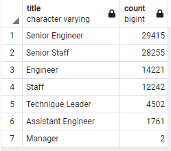
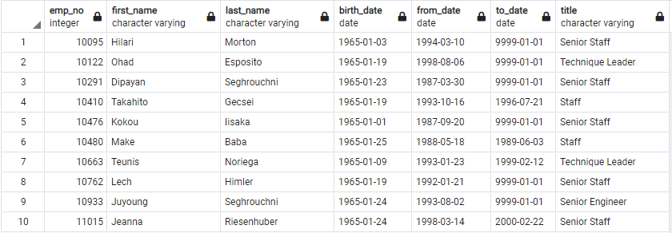

# Pewlett Hackard Analysis with SQL

## Overview of Pewlett Hackard Analysis

### Purpose
The purpose of this analysis was to:
1. determine the number of retiring employees per title;
2. identify employees who are eligible to participate in a mentorship program.

## Results

### Retiring Employees by Title

To determine the number of retiring employees per title, I first created a Retirement Titles table that holds the titles of employees born between January 1, 1952 and December 31, 1955.

```
SELECT employees.emp_no,
    employees.first_name,
    employees.last_name,
    titles.title,
    titles.from_date,
    titles.to_date
INTO retirement_titles
FROM employees
LEFT JOIN titles
ON employees.emp_no = titles.emp_no
WHERE employees.birth_date BETWEEN '1952-01-01' AND '1955-12-31'
ORDER BY employees.emp_no
SELECT * FROM retirement_titles
```

I then removed duplicate rows using the DISTINCT ON statement and returned only the most recent title of each employee.

```
SELECT DISTINCT ON (retirement_titles.emp_no) retirement_titles.emp_no,
    retirement_titles.first_name,
    retirement_titles.last_name,
    retirement_titles.title
INTO unique_titles
FROM retirement_titles
ORDER BY retirement_titles.emp_no, retirement_titles.to_date DESC;
SELECT * FROM unique_titles
```

Using the COUNT function, I finally create a Retiring Titles table which shows the number of retirement age employees by job title.

```
SELECT title, COUNT(*)
INTO retiring_titles
FROM unique_titles
GROUP BY title
ORDER BY 2 DESC
SELECT * FROM retiring_titles
```

The query results produce the following table:



### Employees Eligible for Mentorship Program

To identify the employees who are eligible to participate in a mentorship program, I created a Mentorship Eligibilty table that holds the employees who were born between January 1, 1965 and December 31, 1965.

```
SELECT DISTINCT ON (employees.emp_no) employees.emp_no,
	employees.first_name,
	employees.last_name,
	employees.birth_date,
	dept_emp.from_date,
	dept_emp.to_date,
	titles.title
INTO mentorship_eligibility
FROM employees
LEFT JOIN dept_emp
ON employees.emp_no = dept_emp.emp_no
LEFT JOIN titles
ON titles.emp_no = employees.emp_no
WHERE employees.birth_date BETWEEN '1965-01-01' AND '1965-12-31'
ORDER BY employees.emp_no
SELECT * FROM mentorship_eligibility
```

The query results produce the following table:



Note: This table only shows the first 10 rows. The full table is 1,940 rows.

### Summary of Results
- A total of 90,398 employees are of retirement-age.
- Half of the retirees have "Engineer" in their title, making up 50.2% of the retiring population. Retirees with "Staff" in their title make up another 44.8%. The remaining 5% includes Technique Leaders and Managers.
- A total of 1,940 employees are eligible to be mentors in the mentorship program.
- 

## Pewlett Hackard Analysis Summary
